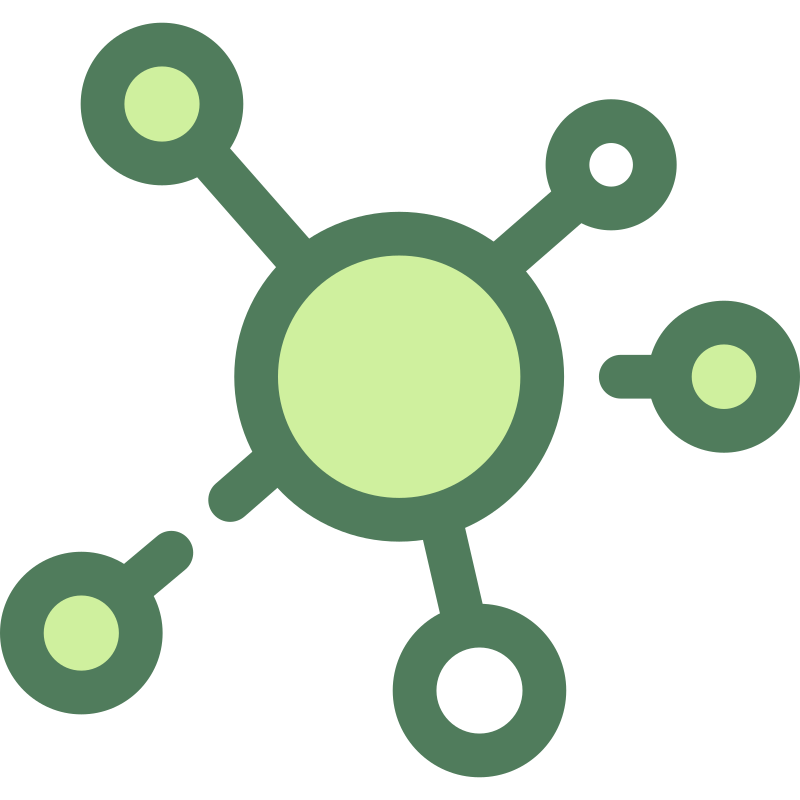

# rMATS-Viz

<p align="center">
  
  &nbsp;&nbsp;&nbsp;
  
</p>

A web application for visualizing and exploring RNA alternative splicing events produced by [rMATS](https://rnaseq-mats.sourceforge.io/). Upload your rMATS output files, create analyses, filter events, curate gene lists, and characterize splice-site signals at single-event resolution.

---

## Table of Contents

- [Overview](#overview)
- [Architecture](#architecture)
- [Project Structure](#project-structure)
- [Quick Start](#quick-start)
- [GRCh38 FASTA Setup](#grch38-fasta-setup)
- [Configuration](#configuration)
- [API](#api)
- [Assets](#assets)

---

## Overview

rMATS-Viz provides a browser-based interface on top of rMATS junction-count output files (e.g. `SE.MATS.JC.txt`). Core features:

- **File upload** — drag-and-drop rMATS `.txt` files with automatic sample-group mapping
- **Analysis management** — create, list, and navigate named analyses
- **Event browser** — sortable/filterable table of splicing events (SE, A5SS, A3SS, MXE, RI)
- **Top-10 view** — ranked events by statistical significance or inclusion level difference
- **Basket** — collect and export genes of interest across analyses
- **Dark mode** — toggle-able theme with persistent preference
- **Gene search** — Ensembl-backed autocomplete by HUGO symbol
- **Gene annotations** — PanelApp disease panels, Gene Ontology terms, UniProt protein function
- **Protein interactions** — STRING-DB evidence scores with Europe PMC PMIDs
- **Splice site analysis** — per-SE-event sequence features computed from the local GRCh38 FASTA:
  - Exon and flanking intron sizes
  - Donor (5'SS) and acceptor (3'SS) sequences with GT-AG canonical check
  - Polypyrimidine tract (PPT) score and longest pyrimidine run
  - Branch-point detection (YNYURAY rule-based motif)
  - Event clustering to deduplicate near-identical exon boundaries
  - Aggregate pattern analysis with PWM and IUPAC consensus across all SE events
- **MANE frame annotation** — maps each skipped exon to its MANE Select transcript via Ensembl REST and classifies the frame impact (`in_frame` / `frameshift` / `non_coding` / `partial`)

---

## Architecture

```
┌─────────────────────────────────────────┐
│              Browser (port 3000)         │
│           Next.js 14 / React 18         │
│     TypeScript · Tailwind CSS · TanStack│
└───────────────────┬─────────────────────┘
                    │ REST (JSON)
┌───────────────────▼─────────────────────┐
│              API (port 8000)             │
│           FastAPI 0.111 / Python         │
│        SQLAlchemy async · Pydantic v2    │
└───────────────────┬─────────────────────┘
                    │ asyncpg
┌───────────────────▼─────────────────────┐
│           PostgreSQL 16 (port 5432)      │
│              Docker volume               │
└─────────────────────────────────────────┘

External services (outbound HTTPS from backend):
  Ensembl REST   — MANE transcript lookup + CDS intervals
  mygene.info    — Gene Ontology terms
  UniProt        — Protein function
  STRING-DB      — Protein-protein interactions
  Europe PMC     — Literature PMIDs
  PanelApp AU    — Disease gene panels
```

All three services are orchestrated with **Docker Compose**.

---

## Project Structure

```
Test_1/
├── assets/
│   └── svg/
│       ├── CONNECT.svg
│       └── DNA.svg
├── rmats-viz/
│   ├── backend/
│   │   ├── Dockerfile
│   │   ├── requirements.txt
│   │   ├── alembic.ini
│   │   ├── alembic/
│   │   │   └── versions/
│   │   │       ├── 0001_initial_schema.py
│   │   │       ├── 0002_add_mutated_genes.py
│   │   │       └── 0003_add_splice_features.py   # event_cluster + event_splice_feature tables
│   │   └── app/
│   │       ├── main.py
│   │       ├── config.py
│   │       ├── database.py
│   │       ├── models/
│   │       │   ├── event.py
│   │       │   └── splice.py                     # EventCluster, EventSpliceFeature
│   │       ├── routers/
│   │       │   ├── analyses.py
│   │       │   ├── events.py
│   │       │   ├── genes.py                      # gene search/autocomplete
│   │       │   ├── annotations.py                # PanelApp, GO, UniProt, STRING
│   │       │   └── splice.py                     # splice site analysis + patterns
│   │       ├── schemas/
│   │       ├── services/
│   │       │   ├── parser.py
│   │       │   ├── event_selector.py
│   │       │   ├── event_cluster.py              # SE event deduplication
│   │       │   ├── sequence.py                   # samtools faidx wrapper
│   │       │   ├── splice_features.py            # GT-AG, PPT, branch-point
│   │       │   ├── mane.py                       # MANE Select + frame class
│   │       │   ├── ensembl.py
│   │       │   ├── gene_ontology.py
│   │       │   ├── uniprot.py
│   │       │   ├── stringdb.py
│   │       │   └── panelapp.py
│   │       └── utils/
│   ├── frontend/
│   │   ├── Dockerfile
│   │   ├── package.json
│   │   ├── tailwind.config.ts
│   │   └── src/
│   │       ├── app/
│   │       │   ├── analyses/
│   │       │   └── layout.tsx
│   │       ├── components/
│   │       │   ├── basket/
│   │       │   ├── events/
│   │       │   ├── layout/
│   │       │   └── upload/
│   │       ├── contexts/
│   │       ├── lib/
│   │       └── types/
│   ├── data/                                     # mounted at /data inside the backend container
│   │   ├── GRCh38.fa                             # GRCh38 FASTA — must be provided (see below)
│   │   ├── GRCh38.fa.fai                         # samtools index — generated once
│   │   └── mane_cache.db                         # SQLite MANE cache — auto-created
│   └── docker-compose.yml
├── docker-compose.yml
├── .env.example
└── SE.MATS.JC.PUROMOINS.sig.txt
```

---

## Quick Start

### Prerequisites

- [Docker](https://docs.docker.com/get-docker/) and [Docker Compose](https://docs.docker.com/compose/)

### 1. Clone and configure

```bash
git clone <repo-url>
cd Test_1
cp .env.example .env          # edit credentials if needed
```

### 2. Provide the GRCh38 FASTA

See [GRCh38 FASTA Setup](#grch38-fasta-setup) below. The application runs without the FASTA (sequence features will be skipped), but MANE frame annotation and splice-site sequences require it.

### 3. Start all services

```bash
docker compose up --build
```

This will:
1. Start PostgreSQL and wait until healthy
2. Build and start the FastAPI backend — runs Alembic migrations then starts Uvicorn
3. Build and start the Next.js frontend

### 4. Open the app

| Service  | URL                                    |
|----------|----------------------------------------|
| Frontend | http://localhost:3000                  |
| API docs | http://localhost:8000/docs             |
| Health   | http://localhost:8000/api/v1/health    |
| FASTA diagnostics | http://localhost:8000/api/v1/debug/fasta |

---

## GRCh38 FASTA Setup

The splice site analysis and MANE frame annotation require a locally indexed GRCh38 FASTA at `/data/GRCh38.fa` inside the backend container (mapped from `rmats-viz/data/` on the host).

### Development (chr19 only, ~60 MB)

If your test data contains only chr19 events:

```bash
cd rmats-viz/data

wget https://hgdownload.soe.ucsc.edu/goldenPath/hg38/chromosomes/chr19.fa.gz
gunzip chr19.fa.gz
mv chr19.fa GRCh38.fa

# Index inside the running container (no local samtools needed)
docker compose exec backend samtools faidx /data/GRCh38.fa
```

### Production (full genome, ~3 GB compressed)

```bash
cd rmats-viz/data

# NCBI RefSeq headers (NC_000001.11 …) — supported natively
wget https://ftp.ncbi.nlm.nih.gov/genomes/all/GCA/000/001/405/GCA_000001405.15_GRCh38/GCA_000001405.15_GRCh38_assembly_structure/Primary_Assembly/assembled_chromosomes/FASTA/...

# Or UCSC chr-style headers (chr1 … chr22, chrX, chrY, chrM) — auto-converted
docker compose exec backend samtools faidx /data/GRCh38.fa
```

Both header styles are supported: the backend auto-detects the naming convention from the `.fai` index and converts rMATS UCSC names to RefSeq accessions when needed.

### Verify

```bash
curl http://localhost:8000/api/v1/debug/fasta
```

Expected: `fasta_exists: true`, `fai_exists: true`, `faidx_test_rc: 0`.

---

## Configuration

Copy `.env.example` to `.env` and adjust as needed:

```env
POSTGRES_USER=rmats
POSTGRES_PASSWORD=rmats
POSTGRES_DB=rmatsdb
DATABASE_URL=postgresql+asyncpg://rmats:rmats@db:5432/rmatsdb
CORS_ORIGINS=["http://localhost:3000"]

# Splice analysis
GRCH38_FASTA=/data/GRCh38.fa        # path inside the container
SAMTOOLS_BIN=samtools               # full path or name if in PATH
MANE_CACHE_DB=/data/mane_cache.db  # SQLite cache for Ensembl MANE lookups
SPLICE_WINDOW=50                    # intronic window (nt) around each splice site
```

The MANE cache (`mane_cache.db`) stores successful Ensembl lookups to avoid repeated API calls across analysis runs. Failed lookups (network errors, no MANE transcript found) are **not** cached and will be retried on the next compute run.

---

## API

The backend exposes a versioned REST API under `/api/v1`:

### Analyses & Events

| Method | Endpoint | Description |
|--------|----------|-------------|
| GET    | `/api/v1/health` | Health check (DB ping) |
| GET    | `/api/v1/analyses` | List all analyses |
| POST   | `/api/v1/analyses` | Create a new analysis (file upload) |
| GET    | `/api/v1/analyses/{id}` | Get analysis details |
| GET    | `/api/v1/analyses/{id}/events` | List/filter events |
| GET    | `/api/v1/analyses/{id}/top10` | Top-10 events |

### Splice Site Analysis

| Method | Endpoint | Description |
|--------|----------|-------------|
| POST   | `/api/v1/splice/compute/{analysis_id}` | Compute splice features + clusters for all SE events |
| GET    | `/api/v1/splice/feature/{event_id}` | Per-event features (on-the-fly if not cached) |
| GET    | `/api/v1/splice/patterns/{analysis_id}` | Aggregate pattern analysis (PWM, consensus, frame stats) |

The compute endpoint is idempotent — re-running overwrites existing feature rows and refreshes clusters. It requires the GRCh38 FASTA for sequence features; if unavailable, size-only features are computed.

**Splice features per SE event:**

| Feature | Description |
|---------|-------------|
| `exon_size` | Skipped exon length (bp) |
| `upstream_intron_size` / `downstream_intron_size` | Flanking intron lengths |
| `donor_seq` | 9 nt window at 5'SS (3 nt exon + GT + 4 nt intron) |
| `acceptor_seq` | 23 nt window at 3'SS (20 nt intron + AG + 3 nt exon) |
| `ppt_seq` | ~47 nt polypyrimidine tract upstream of 3'SS |
| `donor_is_gt` / `acceptor_is_ag` | GT-AG canonical rule |
| `ppt_score` | Fraction of C+T in PPT window |
| `ppt_longest_run` | Longest consecutive pyrimidine run |
| `bp_motif_found` / `bp_distance` / `bp_score` | YNYURAY branch-point motif (score 0–7) |
| `mane_transcript_id` | MANE Select transcript (Ensembl REST) |
| `exon_rank` | Exon position in the MANE transcript (1-based) |
| `frame_region` | `CDS` / `UTR5` / `UTR3` / `partial` / `unknown` |
| `frame_class` | `in_frame` / `frameshift` / `non_coding` / `unknown` |
| `cds_exon_length` | Coding nucleotides in the skipped exon |

### Gene Annotations

| Method | Endpoint | Description |
|--------|----------|-------------|
| GET    | `/api/v1/genes/search?q=` | Ensembl gene autocomplete |
| GET    | `/api/v1/genes/lookup/{symbol}` | Exact gene lookup |
| GET    | `/api/v1/annotations/gene/{symbol}` | PanelApp panels + GO terms + UniProt summary |
| POST   | `/api/v1/annotations/interactions` | STRING-DB interactions + PMIDs |

### Diagnostics

| Method | Endpoint | Description |
|--------|----------|-------------|
| GET    | `/api/v1/debug/fasta` | FASTA + samtools availability check |

Full interactive documentation: **http://localhost:8000/docs** (Swagger UI).

---

## Assets

| File | Description |
|------|-------------|
| `assets/svg/DNA.svg` | DNA helix icon (36×36, Twemoji-style) |
| `assets/svg/CONNECT.svg` | Network connection diagram (512×512) |
| `rmats-viz/frontend/public/logo.svg` | Application logo |
